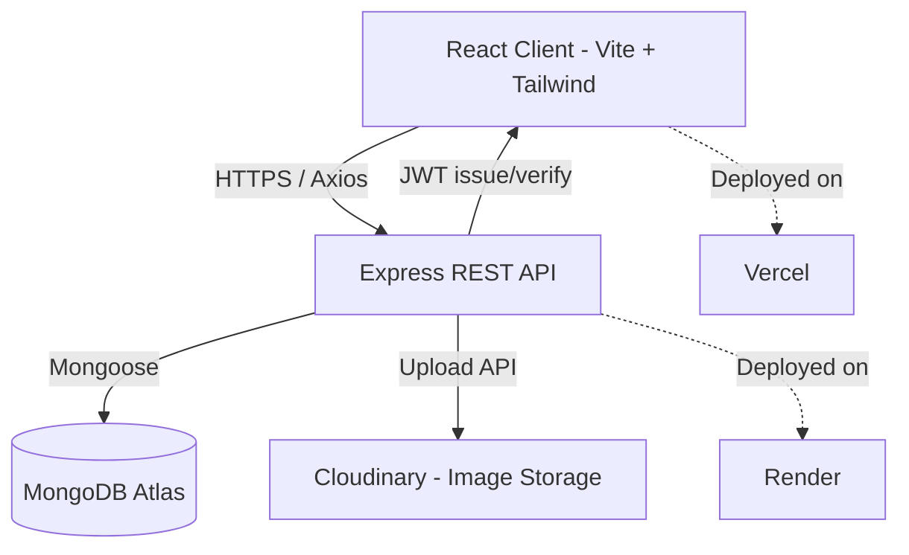
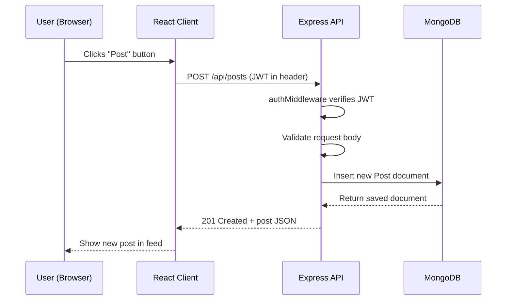
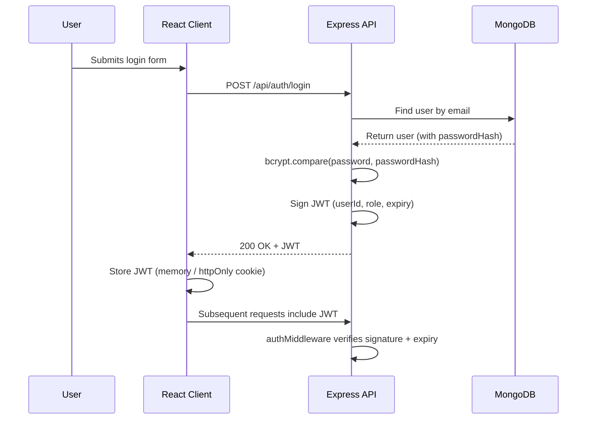
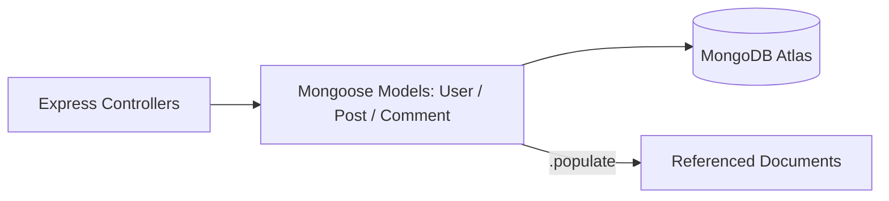

# DevOrbit — System Architecture

## 1. Overview

DevOrbit is a three-tier MERN application:

- **Client** — React (Vite) SPA, styled with Tailwind CSS, talks to the API over HTTPS via Axios
- **Server** — Node.js + Express REST API, stateless (JWT-based auth), talks to MongoDB via Mongoose
- **Database** — MongoDB Atlas (free M0 cluster)
- **External Service** — Cloudinary (free tier), used only for image storage (profile pictures, post images)

There is no real-time layer (no sockets) and no AI service in v1.0 — those are out of scope per the SRD.

## 2. High-Level Architecture



**Explanation:** The client never talks to MongoDB or Cloudinary directly — everything routes through the Express API, which is the single point of authentication, validation, and business logic. This keeps the frontend "dumb" (display + user input only) and the backend as the sole source of truth.

## 3. Request Lifecycle



**Explanation:** Every write request follows this pattern: auth check → validation → database operation → JSON response. This consistency is what makes debugging predictable across all 18 endpoints.

## 4. Authentication Flow



**Explanation:** Passwords are never sent back or logged. Once issued, the JWT is the only thing proving identity on later requests — no server-side session store needed, which is why this scales fine on Render's free tier.

## 5. Database Interaction



**Explanation:** Controllers never touch MongoDB directly — they go through Mongoose models, which enforce schema validation before anything is written, and handle `.populate()` for pulling in referenced author/user data when a feed or profile is requested.

## 6. Environment Variables

**Server (`server/.env`):**
```
MONGO_URI=
JWT_SECRET=
JWT_EXPIRE=7d
CLOUDINARY_CLOUD_NAME=
CLOUDINARY_API_KEY=
CLOUDINARY_API_SECRET=
CLIENT_URL=
PORT=5000
```

**Client (`client/.env`):**
```
VITE_API_BASE_URL=
```

Both `.env` files are gitignored (already covered by the Node `.gitignore` template chosen at repo creation).

## 7. Deployment Topology

| Layer | Service | Notes |
|---|---|---|
| Frontend | Vercel (free) | Auto-deploy on push to `main` |
| Backend | Render (free web service) | Cold start after inactivity — expected, not a bug |
| Database | MongoDB Atlas (free M0) | Shared cluster, sufficient for portfolio scale |
| Media | Cloudinary (free tier) | Required since Render's filesystem is ephemeral |