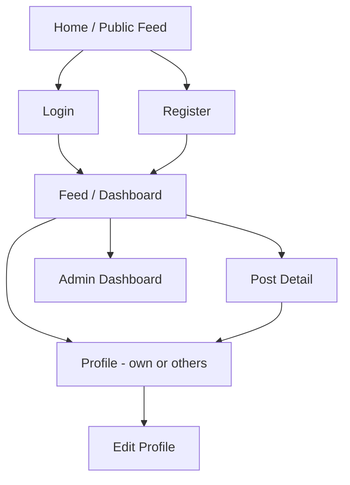

# DevOrbit — UI & UX Design

## 1. User Journey

Guest lands on the public feed (read-only) → clicks Register → creates account → logs in → completes profile (photo + bio) → browses feed, filters by tag → creates a post → others like/comment/follow → checks own profile (posts, followers/following) → Admin (separate account) moderates via dashboard.

## 2. Navigation Flow

## 3. Pages — Purpose, Components, States

### Home / Public Feed
- **Purpose:** Entry point; lets guests see value before registering
- **Components:** Navbar, TagFilterBar, PostCard (list)
- **User Actions:** browse, filter by tag, click "Register" prompt on interaction attempt
- **API Calls:** `GET /posts`
- **Loading State:** skeleton post cards
- **Empty State:** "No posts yet — be the first to share something!"
- **Error State:** "Couldn't load the feed — retry" button

### Register
- **Purpose:** Account creation
- **Components:** AuthForm
- **User Actions:** submit name/username/email/password
- **API Calls:** `POST /auth/register`
- **Loading State:** disabled submit button + spinner
- **Empty/Error State:** inline field validation errors; toast on server error (e.g. duplicate email)

### Login
- **Purpose:** Authenticate returning users
- **Components:** AuthForm
- **User Actions:** submit email/password
- **API Calls:** `POST /auth/login`
- **Error State:** toast "Invalid email or password"

### Feed / Dashboard (authenticated)
- **Purpose:** Main logged-in experience — post creation + browse
- **Components:** Navbar, PostForm, TagFilterBar, PostCard (list)
- **User Actions:** create post, like, filter, navigate to post detail or profile
- **API Calls:** `GET /posts`, `POST /posts`, `POST/DELETE /posts/:id/like`
- **Loading State:** skeleton cards on feed load; button spinner on post submit
- **Empty State:** "Your feed is empty — try a different tag or follow more devs"
- **Error State:** toast + retry option

### Post Detail
- **Purpose:** Full post view + comment thread
- **Components:** PostCard (expanded), CommentList, CommentForm
- **User Actions:** comment, like, delete (if owner/admin)
- **API Calls:** `GET /posts/:id`, `GET/POST /posts/:id/comments`, `DELETE /comments/:id`
- **Empty State:** "No comments yet — start the conversation"
- **Error State:** toast on comment failure

### Profile (own or others')
- **Purpose:** Show a user's posts, bio, follow stats
- **Components:** ProfileCard, FollowButton (if not own profile), PostCard (list, filtered to user)
- **User Actions:** follow/unfollow, view followers/following, edit (if own)
- **API Calls:** `GET /users/:id`, `POST/DELETE /users/:id/follow`
- **Empty State:** "This user hasn't posted yet"

### Edit Profile / Settings
- **Purpose:** Update own bio, name, avatar
- **Components:** AuthForm-style edit form + image upload input
- **API Calls:** `PUT /users/:id`
- **Loading State:** disabled save button during upload
- **Error State:** inline validation + toast on upload failure

### Admin Dashboard
- **Purpose:** Moderation — users and posts
- **Components:** AdminUserRow (list), AdminPostRow (list)
- **User Actions:** deactivate user, delete any post/comment
- **API Calls:** `GET /admin/users`, `PATCH /admin/users/:id`, `GET /admin/posts`, `DELETE /posts/:id`
- **Empty State:** N/A (always has data once users/posts exist)

### 404
- **Purpose:** Catch-all for invalid routes
- **Components:** simple message + "Back to Feed" link

## 4. Design Principle

Every screen above maps directly to a functional requirement in the SRD — no screen exists "because social apps usually have one." This is the scope-creep guardrail for the UI layer.